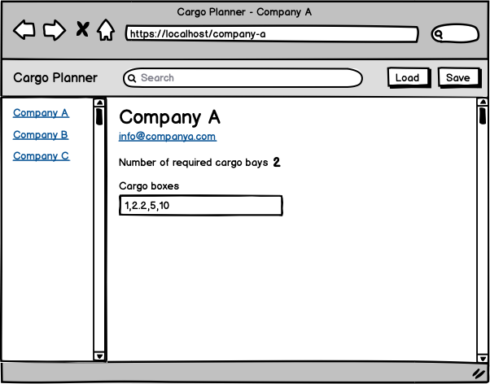

# SpaceX Cargo Planner
[Demo url](https://sooryasoorya.github.io/spacex-cargo-planner/)

SpaceX is experiencing an increasing demand of shipments to Mars and has commissioned an application to automate the needed cargo space calculations.

## High level overview

The application should load existing set of shipments over the network. After which they can be filtered, viewed, edited and saved locally for later viewing.

As a first feature it will calculate the required number of cargo bays for each shipment.

## UI



The application will mostly be used on desktop environments but it should be usable on smaller viewports too.

## Functionality

- When the user loads the application it first checks for locally saved shipments and loads them. In case there are none it displays a message asking to load a set over the network.

- Clicking the “Load” button loads all the shipments over the network from _shipments.json_ overwriting any existing ones.

- Clicking the “Save” button saves the existing state of shipments locally for later usage.

- Typing in a search box filters the existing list of loaded shipments by company name.

- Clicking a specific shipment displays the shipment details.

- Each shipment details view should have an unique URL.

- Changing the “Cargo boxes” field recalculates the needed number of cargo bays.

### Calculating the needed number of cargo bays

Each shipment specifies a comma separated string of cargo box units where each unit is represented by a number.

```JSON
{
  "id": "d3ff0c68892",
  "name": "Amazon.com",
  "email": "contact@amazon.com",
  "boxes": "6.8,7.9,3"
}
```

The following shipment consists of 3 cargo boxes with the following units 6.8, 7.9 and 3.

Each Starship cargo bay can hold up to **10** units.

The example shipment would require 2 cargo bays.

Another shipment `6.2,5.9,4,6.9,4.4,1.7,9.5` would require 4 cargo bays.<br />

## How to load the App in local

The project uses Node.js and the [Create React App](https://github.com/facebook/create-react-app) starter. If you do not have Node >= 6.x installed, you can download it here: [Node.js](https://nodejs.org/en/)

Once Node is installed, navigate to the directory where you want to store the app run commands:

```
git clone https://github.com/SooryaSoorya/spacex-cargo-planner.git

npm install
```

Once all of the dependencies have been installed successfully from the project directory you can launch the app with

```
npm start
```

A new browser window should automatically open displaying the app. If it doesn't, navigate to [http://localhost:3000/](http://localhost:3000/) in your browser

The page will reload if you make edits.<br />
You will also see any lint errors in the console. <br/>

Launche the test runner in the interactive watch mode with <br />

```
npm test
```

See the section about [running tests](https://facebook.github.io/create-react-app/docs/running-tests) for more information.

Builds the app for production to the `build` folder with<br />

```
npm run build
```
Have used [gh-pages](https://github.com/tschaub/gh-pages) to deploy the app<br />
It correctly bundles React in production mode and optimizes the build for the best performance.
The build is minified and the filenames include the hashes.<br />
Your app is ready to be deployed!!
